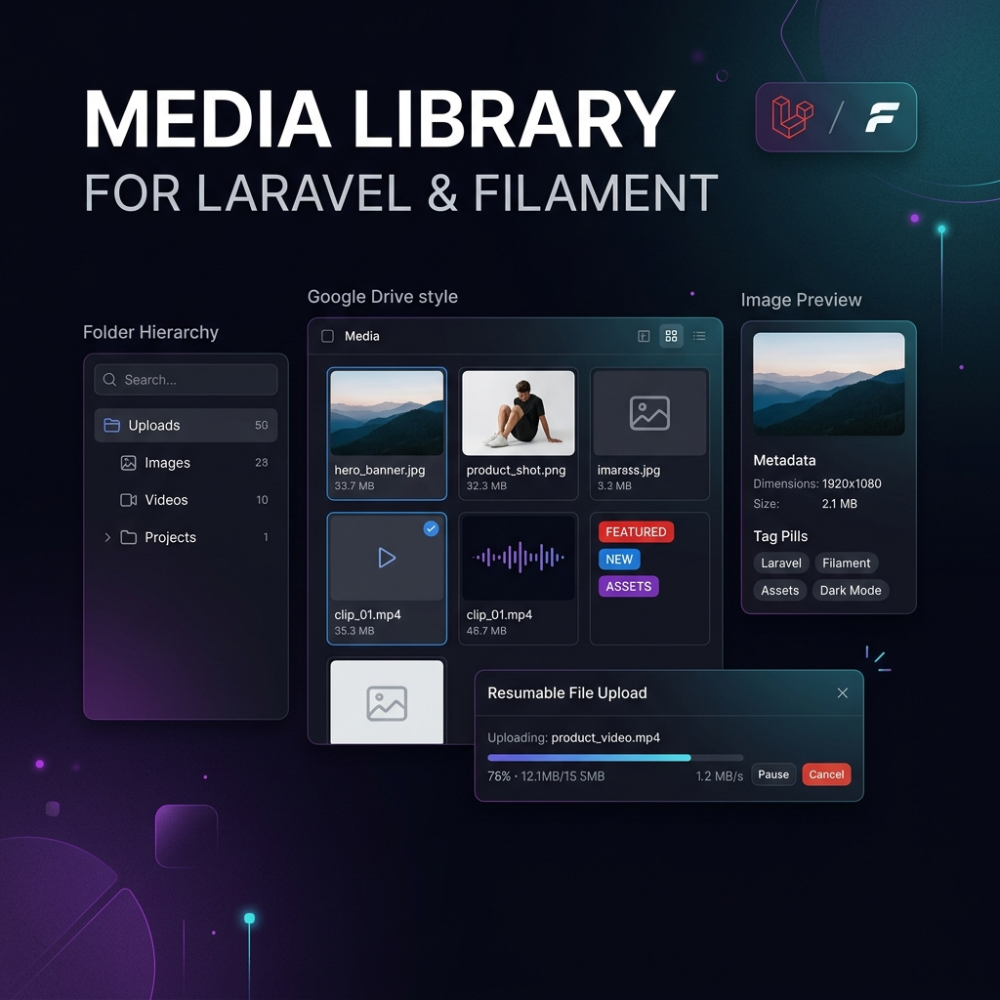

<p align="center">
  
</p>

# tsrgtm/media-library

[](https://packagist.org/packages/tsrgtm/media-library)
[](https://packagist.org/packages/tsrgtm/media-library)
[](https://php.net)
[](https://laravel.com)
[](https://filamentphp.com)
[](LICENSE.md)

A high-performance, enterprise-grade Laravel media library and Google Drive-style **Filament 5 workspace**. Built by **Tusar Gautam**, featuring TUS resumable uploads with multi-file concurrency, zero-migration polymorphic model attachments, dynamic WebP responsive conversions, folder hierarchies, tag management, trash bin soft-deletes, static placeholder caching, and rich previews for documents, video, audio, code, and spreadsheets.

---

## Table of Contents

- [Key Features](#key-features)
- [Zero Schema Hassle](#zero-schema-hassle)
- [Requirements](#requirements)
- [Installation & Setup](#installation--setup)
- [Package Management Commands](#package-management-commands)
  - [1. Installing the Package (`media-library:install`)](#1-installing-the-package-media-libraryinstall)
  - [2. Updating Assets & Migrations (`media-library:update`)](#2-updating-assets--migrations-media-libraryupdate)
  - [3. Uninstalling & Reverting Changes (`media-library:uninstall`)](#3-uninstalling--reverting-changes-media-libraryuninstall)
- [Tailwind CSS & Styling Setup](#tailwind-css--styling-setup)
- [Filament Panel & Plugin Customization](#filament-panel--plugin-customization)
- [Model Configuration (`HasMedia` Trait)](#model-configuration-hasmedia-trait)
  - [1. Adding Trait to Models](#1-adding-trait-to-models)
  - [2. Attaching, Syncing, and Detaching Media](#2-attaching-syncing-and-detaching-media)
  - [3. Retrieving Media & Collections](#3-retrieving-media--collections)
  - [4. Replacing Media](#4-replacing-media)
- [Filament Media Picker Form Component](#filament-media-picker-form-component)
  - [1. Single File Picker](#1-single-file-picker)
  - [2. Multi-File Picker with Reordering](#2-multi-file-picker-with-reordering)
  - [3. Filtering by Kinds, Extensions, and MIME Types](#3-filtering-by-kinds-extensions-and-mime-types)
  - [4. Default Folder & Custom Pivot Properties](#4-default-folder--custom-pivot-properties)
  - [5. Component Options Reference](#5-component-options-reference)
- [Placeholder Caching & Performance](#placeholder-caching--performance)
- [Resumable TUS Uploads & Queue Processing](#resumable-tus-uploads--queue-processing)
- [API Controllers & Routes](#api-controllers--routes)
- [Configuration Reference](#configuration-reference)
- [Testing](#testing)
- [License](#license)

---

## Key Features

- 🔗 **Zero Database Schema Hassle**: Attach single or multiple media items to any model using polymorphic relations — **no database columns, foreign keys, or migrations needed on your tables**.
- 🛠️ **Complete Lifecycle Commands**: Includes `media-library:install`, `media-library:update`, and `media-library:uninstall` to install, upgrade, or cleanly revert all changes without errors.
- 📁 **Google Drive-Style Workspace**: Full-page Filament 5 panel interface with grid/list view toggles, marquee item selection, drag-and-drop folder moving, and path breadcrumbs.
- ⚙️ **Fully Customizable Plugin**: Easily customize navigation icon, menu group, sort order, page label, and URL slugs directly on the plugin instance.
- 🎨 **Self-Sufficient CSS & Tailwind v4**: Includes standalone Tailwind CSS directives so component UI renders cleanly out-of-the-box.
- ⚡ **TUS Resumable Uploads**: Multi-file chunked upload engine supporting up to 4 concurrent streams with auto-resume on network failure.
- 🖼️ **Responsive Image Engine**: Automatic WebP generation with configurable width breakpoints (`thumbnail`, `small`, `medium`, `large`).
- 🚀 **Static Placeholder Caching**: In-memory memoization of SVG/PNG placeholder URLs to eliminate repetitive config and asset resolution during bulk media serialization.
- 🏷️ **Tag & Folder Hierarchy**: Nested folder organization with soft-delete cascade and dynamic tag management.
- ♻️ **Trash Bin & Soft Deletes**: Two-stage deletion with restore and permanent force-delete capabilities.
- 🔄 **In-Place File Replacement**: Update media contents while preserving original URLs and database model relationships.
- 👁️ **Rich Media Lightbox Previews**: Built-in visualizers for Images, Videos, Audio, PDF, DOCX, XLSX, Markdown, and Source Code syntax highlighting.

---

## Zero Schema Hassle

> [!IMPORTANT]
> **No database changes required for your models!**  
> You do **NOT** need to create any columns (such as `featured_image_id`, `media_id`, or `gallery_ids`) or write any database migrations for your `posts`, `products`, `users`, or `categories` tables.

`tsrgtm/media-library` manages all attachments through a central, highly-optimized polymorphic `mediables` table.

```
+-------------------------------------------------------------------+
|                            YOUR MODEL                             |
|  Post { id: 1, title: "My Post", content: "..." }                  |
|  (Zero extra database columns required!)                           |
+---------------------------------+---------------------------------+
                                  |
               Polymorphic Relation via HasMedia Trait
                                  |
                                  v
+-------------------------------------------------------------------+
|                         mediables TABLE                           |
|  mediable_type: "App\Models\Post"                                 |
|  mediable_id:   1                                                 |
|  collection:    "featured" / "gallery" / "downloads"              |
|  media_id:      42                                                |
|  sort_order:    1                                                 |
+-------------------------------------------------------------------+
```

---

## Requirements

- **PHP**: `^8.3`
- **Laravel**: `^12.0` or `^13.0`
- **Filament**: `^5.0`
- **Livewire**: `^4.0`

---

## Installation & Setup

### 1. Require via Composer

```bash
composer require tsrgtm/media-library
```

### 2. Run Package Installer

Run the automated installer command:

```bash
php artisan media-library:install
```

This command automatically:
- Publishes configuration (`config/media-library.php`)
- Publishes placeholder icon assets (`public/images/media-placeholders`)
- Publishes database migrations
- Publishes frontend assets
- Installs NPM dependencies (`tus-js-client`, `video.js`, `pdfjs-dist`, `docx-preview`, `xlsx`, `marked`, `highlight.js`)
- Auto-registers the Filament plugin in your Panel Provider

### 3. Run Migrations

```bash
php artisan migrate
```

### 4. Build Frontend Assets

```bash
npm run build
```

---

## Package Management Commands

### 1. Installing the Package (`media-library:install`)

```bash
php artisan media-library:install
```

*Options:*
- `--force`: Overwrite existing published frontend source files.
- `--no-npm`: Skip automatic NPM dependency installation.
- `--panel-provider=path`: Custom path to your Filament panel provider (default: `app/Providers/Filament/AdminPanelProvider.php`).

### 2. Updating Assets & Migrations (`media-library:update`)

When upgrading `tsrgtm/media-library` to a new release, run the update command to sync updated JS/CSS assets, replace modified files, and run pending database migrations:

```bash
php artisan media-library:update
```

*Options:*
- `--force`: Force overwrite all published frontend assets and configuration files.

### 3. Uninstalling & Reverting Changes (`media-library:uninstall`)

To completely revert all changes made by the package cleanly without leaving orphaned code or throwing errors:

```bash
php artisan media-library:uninstall
```

This command automatically:
- Unregisters `MediaLibraryPlugin` from your Filament Panel Provider.
- Reverts patches in `resources/js/app.js` and Filament `theme.css`.
- Deletes published JS/CSS vendor assets and placeholder images.
- Drops package database tables (`media`, `media_folders`, `mediables`, `media_tags`, `media_upload_sessions`) and deletes `config/media-library.php`.
- Clears optimization caches.

*Options:*
- `--keep-data`: Reverts code integration and published assets while preserving database tables and uploaded files.
- `--force`: Runs uninstall without interactive prompts.

After running uninstall, complete package removal via Composer:

```bash
composer remove tsrgtm/media-library
```

---

## Tailwind CSS & Styling Setup

### Self-Sufficient CSS (Zero Configuration)
The package ships with self-sufficient CSS in `resources/css/media-library.css` containing standalone Tailwind CSS directives. Component styles render cleanly out of the box without requiring manual CSS edits.

### Custom Filament Theme Configuration
If you are compiling a custom Filament Tailwind CSS theme (e.g. `resources/css/filament/admin/theme.css`), add the package `@source` directives so Vite scans package views during build:

```css
@import "tailwindcss";
@import "../../../../vendor/filament/filament/resources/css/theme.css";

/* Include Tsrgtm Media Library Package Sources */
@source '../../../../vendor/tsrgtm/media-library/resources/views/**/*.blade.php';
@source '../../../../vendor/tsrgtm/media-library/src/**/*.php';
@source '../../../../vendor/tsrgtm/media-library/resources/js/**/*.js';
```

---

## Filament Panel & Plugin Customization

Register the `MediaLibraryPlugin` inside your Filament Panel Provider (e.g., `app/Providers/Filament/AdminPanelProvider.php`).

You can customize navigation group, icon, label, sort position, and URL slug directly on the plugin builder:

```php
use Filament\Support\Icons\Heroicon;
use Tsrgtm\MediaLibrary\MediaLibraryPlugin;

public function panel(Panel $panel): Panel
{
    return $panel
        // ... other panel configuration
        ->plugin(
            MediaLibraryPlugin::make()
                ->navigationGroup('Content')              // Set navigation group (default: 'Content')
                ->navigationIcon(Heroicon::OutlinedPhoto) // Set custom menu icon
                ->navigationLabel('Media Manager')        // Set custom menu title (default: 'Media Library')
                ->navigationSort(15)                      // Set custom menu position (default: 20)
                ->slug('media-manager')                   // Set custom URL slug (default: 'media-library')
                ->shouldRegisterNavigation(true)          // Conditionally show in navigation menu
        );
}
```

---

## Model Configuration (`HasMedia` Trait)

### 1. Adding Trait to Models

Simply include the `HasMedia` trait in any Eloquent model. **No database columns or migrations are needed!**

```php
namespace App\Models;

use Illuminate\Database\Eloquent\Model;
use Tsrgtm\MediaLibrary\Concerns\HasMedia;

class Post extends Model
{
    use HasMedia; // That's it! No extra database columns required.

    protected $fillable = [
        'title',
        'slug',
        'content',
    ];
}
```

### 2. Attaching, Syncing, and Detaching Media

Use the trait methods to link `Media` records to model instances seamlessly:

```php
use App\Models\Post;
use Tsrgtm\MediaLibrary\Models\Media;

$post = Post::find(1);
$coverImage = Media::find(10);
$galleryMediaIds = [11, 12, 13];

// Attach a single media item to a specific collection (default: 'default')
$post->attachMedia($coverImage, collection: 'featured');

// Attach with custom pivot properties and explicit sort order
$post->attachMedia(
    media: $coverImage,
    collection: 'featured',
    customProperties: ['caption' => 'Cover Photo', 'alt_text' => 'Hero Banner'],
    sortOrder: 1
);

// Sync multiple media IDs to a collection (automatically handles ordering)
$post->syncMedia($galleryMediaIds, collection: 'gallery');

// Detach a single media item from a collection
$post->detachMedia($coverImage, collection: 'featured');

// Clear an entire collection
$post->clearMediaCollection('gallery');
```

### 3. Retrieving Media & Collections

```php
// Retrieve all media items in a collection as an Eloquent Collection
$galleryItems = $post->getMedia('gallery');

foreach ($galleryItems as $item) {
    echo $item->url;            // Main asset route / public URL
    echo $item->thumbnail_url;  // WebP thumbnail or SVG/PNG fallback placeholder
    echo $item->original_name;  // Original uploaded file name
}

// Retrieve the first media item in a collection
$featuredImage = $post->getFirstMedia('featured');

if ($featuredImage) {
    echo $featuredImage->url;
}

// Access the polymorphic morphToMany relationship directly
$allMedia = $post->media; // Ordered by pivot sort_order
```

### 4. Replacing Media

To swap an existing collection's media with a new file:

```php
$newCover = Media::find(25);

// Clears the 'featured' collection and attaches the new cover
$post->replaceMedia($newCover, collection: 'featured');
```

---

## Filament Media Picker Form Component

The package includes an interactive `MediaPicker` form field for Filament resources and forms.

> [!NOTE]
> `MediaPicker` automatically hydrates its state from your model's media collection and automatically saves relationship attachments on form submission. You do **not** need a matching column on your database table.

### 1. Single File Picker

```php
use Tsrgtm\MediaLibrary\Filament\Forms\Components\MediaPicker;

MediaPicker::make('featured_cover')
    ->label('Featured Cover Image')
    ->collection('featured')
    ->images();
```

### 2. Multi-File Picker with Reordering

```php
MediaPicker::make('product_gallery')
    ->label('Product Gallery')
    ->collection('gallery')
    ->multiple()
    ->minItems(1)
    ->maxItems(8)
    ->reorderable()
    ->removable();
```

### 3. Filtering by Kinds, Extensions, and MIME Types

Limit what files users can select or upload in the modal:

```php
// Filter by media kinds ('image', 'video', 'audio', 'document', 'archive')
MediaPicker::make('downloadable_file')
    ->collection('downloads')
    ->acceptedKinds(['document', 'archive']);

// Filter by explicit file extensions
MediaPicker::make('pdf_document')
    ->collection('documents')
    ->acceptedExtensions(['pdf', 'docx', 'xlsx']);

// Filter by MIME types
MediaPicker::make('audio_track')
    ->collection('audio')
    ->acceptedMimeTypes(['audio/mpeg', 'audio/wav', 'audio/ogg']);
```

### 4. Default Folder & Custom Pivot Properties

```php
MediaPicker::make('brand_logo')
    ->collection('logo')
    ->defaultFolder('brand-assets')
    ->customProperties([
        'usage' => 'header-logo',
    ]);
```

### 5. Component Options Reference

| Method | Type | Description | Default |
| :--- | :--- | :--- | :--- |
| `collection(string \| Closure)` | `static` | Sets the pivot collection identifier. | `'default'` |
| `multiple(bool \| Closure)` | `static` | Allows selecting multiple media files. | `false` |
| `minItems(int \| Closure)` | `static` | Minimum required items when multiple. | `null` |
| `maxItems(int \| Closure)` | `static` | Maximum allowed items when multiple. | `null` |
| `acceptedKinds(array \| string)` | `static` | Restrict selection by kinds (`image`, `video`, `audio`, `document`, `archive`). | `[]` |
| `images()` | `static` | Convenient shortcut for `acceptedKinds(['image'])`. | - |
| `videos()` | `static` | Convenient shortcut for `acceptedKinds(['video'])`. | - |
| `audio()` | `static` | Convenient shortcut for `acceptedKinds(['audio'])`. | - |
| `documents()` | `static` | Convenient shortcut for `acceptedKinds(['document'])`. | - |
| `archives()` | `static` | Convenient shortcut for `acceptedKinds(['archive'])`. | - |
| `acceptedExtensions(array)` | `static` | Restrict by extension list (e.g. `['png', 'jpg', 'pdf']`). | `[]` |
| `acceptedMimeTypes(array)` | `static` | Restrict by MIME types (e.g. `['image/png']`). | `[]` |
| `defaultFolder(string)` | `static` | Pre-opens picker modal to a folder slug. | `null` |
| `reorderable(bool)` | `static` | Enables drag-and-drop reordering. | `true` |
| `removable(bool)` | `static` | Allows removing selected media. | `true` |
| `replaceable(bool)` | `static` | Allows swapping selected item. | `true` |
| `showFolders(bool)` | `static` | Shows folder browser in picker modal. | `true` |

---

## Placeholder Caching & Performance

When serving APIs or rendering lists with hundreds of media records, looking up extension/kind fallback placeholders continuously can introduce unnecessary CPU overhead.

`tsrgtm/media-library` features **in-memory static placeholder caching**:

- **Model Memoization**: `Media::getPlaceholderUrlAttribute()` and `Media::getKindPlaceholderUrlAttribute()` cache asset paths per extension and kind combination during request lifecycle execution.
- **Folder Icon Caching**: `MediaFolder::getThumbnailUrlAttribute()` caches resolved folder icons statically.
- **Testing & Cache Clearing**: You can clear memoized caches anytime in unit tests or long-running workers:

```php
use Tsrgtm\MediaLibrary\Models\Media;
use Tsrgtm\MediaLibrary\Models\MediaFolder;

Media::clearPlaceholderCache();
MediaFolder::clearThumbnailUrlCache();
```

---

## Resumable TUS Uploads & Queue Processing

Large files (videos, high-res images, archives) are uploaded via chunked TUS HTTP protocols:

- **Chunks & Concurrency**: 8MB upload chunks with 4 parallel browser connections.
- **Auto-Resume**: Network drops resume from exact byte offset without restarting.
- **Queue Connection**: WebP conversion and responsive variants process via queued jobs:

```env
MEDIA_QUEUE_CONNECTION=database
```

Run worker process in production:

```bash
php artisan queue:work
```

---

## API Controllers & Routes

The package registers administrative and file endpoints under `config('media-library.route_prefix')` (default `/media`):

| Route | Name | Description |
| :--- | :--- | :--- |
| `GET /media/files/{media}` | `media.files.show` | Streams media file contents (soft-delete safe). |
| `GET /media/files/{media}/variant/{variant}` | `media.files.variant` | Streams WebP responsive image variant. |
| `GET /media/picker/browse` | `media.picker.browse` | JSON endpoint for Filament `MediaPicker` modal. |
| `POST /media/picker/resolve` | `media.picker.resolve` | Resolves media details by array of IDs. |
| `POST /media/tus` | `media.tus.create` | Creates TUS resumable upload session. |
| `PATCH /media/tus/{session}` | `media.tus.append` | Appends uploaded chunk data to file session. |
| `HEAD /media/tus/{session}` | `media.tus.offset` | Queries current upload byte offset. |
| `DELETE /media/tus/{session}` | `media.tus.delete` | Cancels and purges upload session. |

---

## Configuration Reference

Package settings located in `config/media-library.php`:

```php
return [
    // Route Prefix & Authentication Middleware
    'route_prefix' => env('MEDIA_LIBRARY_ROUTE_PREFIX', 'media'),
    'middleware'   => ['web', 'auth'],

    // Disks
    'disk'           => env('MEDIA_DISK', 'public'),
    'temporary_disk' => env('MEDIA_TEMP_DISK', 'local'),

    // Upload Constraints
    'small_file_threshold'        => 10 * 1024 * 1024, // 10MB
    'chunk_size'                  => 8 * 1024 * 1024,  // 8MB
    'maximum_upload_size'         => 5 * 1024 * 1024 * 1024, // 5GB
    'concurrent_uploads'          => 4,

    // Image WebP Conversions & Quality
    'image' => [
        'quality' => 82,
        'conversions' => [
            'thumbnail' => 320,
            'small'     => 640,
            'medium'    => 1024,
            'large'     => 1600,
        ],
    ],

    // Queue Engine
    'queue_connection' => env('MEDIA_QUEUE_CONNECTION', 'database'),
];
```

---

## Testing

Run the Pest test suite:

```bash
composer test
```

Or execute directly via Pest:

```bash
php vendor/bin/pest
```

---

## License

The MIT License (MIT). Please see [LICENSE.md](LICENSE.md) for more details.
